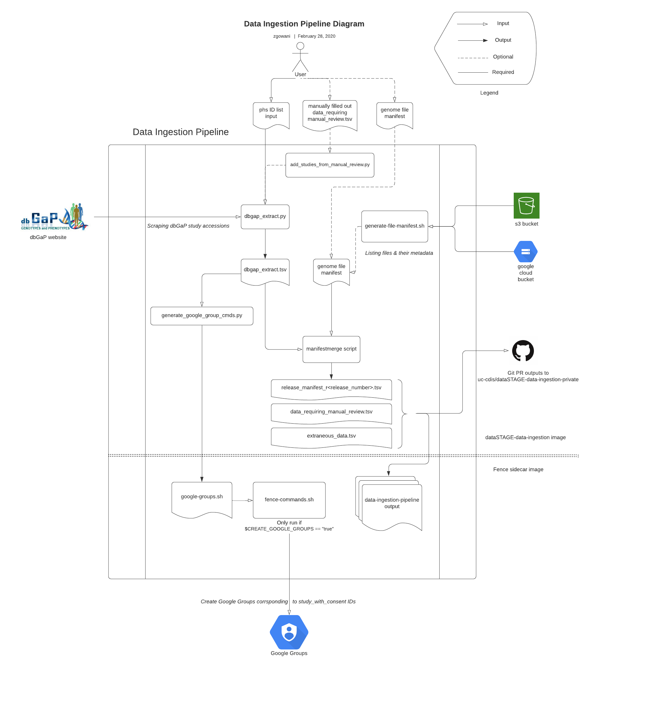

# Data Ingestion Pipeline

## Overview
The data-ingestion-pipeline is an automated tool that helps commons administrators keep their data commons in sync with newly published research data. 

The tool can retrieve and collate data from dbGaP and cloud storage buckets. It prepares the data for insertion into indexd.

## Details
As input, the tool takes a file containing a list of study accession IDs. It hits dbGaP API for information related to these study accessions. It then performs a join with a genome file manifest (generated from an external bucket) against the submitted sample ID column (matching NWD IDs from dbGaP to file names in the external bucket).

As output, the tool makes a pull request to a [private GitHub repository](https://github.com/uc-cdis/dataSTAGE-data-ingestion-private) with the newly joined data, artifacts related to missing data, and logs from the operation.

The successful records ready to be indexed are written to a file called `release_manifest_r<release-number>.tsv`, where the `<release-number>` is incremented from the previous release. This "release manifest" can be used to insert records into indexd. 

For the merging of IRC single sample CRAMs and VCFs between the external Google bucket and dbGaP: Sample IDs in the file manifest that had no corresponding pair in the study accessions provided are placed in a file called `data_requiring_manual_review.tsv`. A human user can later complete the missing fields in this file manually and optionally provide it to the tool on a future run for it to be included in the outputs.

A genome file manifest can be optionally be provided as an input to the flow. If it is not provided, the tool will generate one using specific AWS and GS buckets containing data of interest. 

Additionally, a shell script is generated containing Fence commands that create Google Groups corresponding to the `study_with_consent` ids of the form `phs001234.c1`. The Kubernetes job wrapper in the [cloud-automation](https://github.com/uc-cdis/cloud-automation/blob/master/kube/services/jobs/data-ingestion-job.yaml) repository then executes these Fence commands inside a Fence sidecar image. This enables Fence to control who goes into these groups based on external authorization providers like dbGaP. The Google Groups themselves help to power the various Data Access Methods Fence exposes (including signed urls and temporary credentials).

[View on LucidChart](https://www.lucidchart.com/documents/view/ae33584d-6fc3-45ad-8e6d-5fcf8be6cf46)

## Testing
This repo has a suite of unit tests which be run like so:

    cd scripts/tests
    ./test_all.sh
